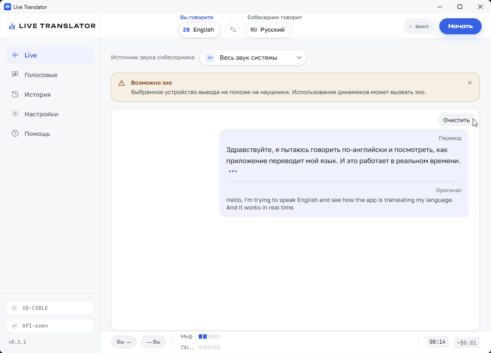

<div align="center">

# 🎙️ Live Translator

**Перевод голоса в реальном времени для звонков на Windows.**
Говорите на своём языке — собеседник слышит перевод. Он говорит — вы слышите перевод в наушниках. Плюс перевод голосовых сообщений.



</div>

---

## Что это

**Live Translator** переводит речь во время звонков (Zoom, Google Meet, Teams и др.) **в обе стороны одновременно** и с низкой задержкой, используя **Gemini Live API**. Также умеет переводить и озвучивать **голосовые сообщения** (например, из WhatsApp).

Весь захват/вывод звука (WASAPI) и обе WebSocket-сессии Gemini живут в нативном Rust-бэкенде (Tauri 2). Фронтенд — чистый React + интерфейс на русском и английском.

## ✨ Возможности

- **Живой перевод в обе стороны** — ваш микрофон → перевод → собеседник; звук собеседника → перевод → ваши наушники.
- **Низкая задержка** на модели `gemini-3.5-live-translate-preview` (70+ языков).
- **Приглушение собеседника** (ducking) на время перевода и плавное восстановление громкости.
- **Подмешивание оригинального голоса** под перевод (опционально), чтобы сохранить интонацию.
- **Проброс микрофона в простое** — когда перевод выключен, ваш обычный голос всё равно идёт в звонок (не нужно переключать устройства).
- **Голосовые сообщения** — перетащите аудиофайл для транскрипта и перевода, или запишите голос: он будет переведён, озвучен (с выбором голоса TTS) и сохранён как `.ogg` для отправки обратно.
- **История** звонков и голосовых в локальной SQLite с поиском.
- **Мастер первого запуска** и подробная вкладка **«Помощь»** прямо в приложении.
- Явные подписи направления («Вы говорите» / «Собеседник говорит») и пометки «Оригинал» / «Перевод» в транскрипте.

## 📦 Установка

1. Скачайте установщик со страницы **[Releases](https://github.com/prodbyEDDY/windows-live-translator/releases/latest)** — файл `Live Translator_*_x64-setup.exe`.
2. Запустите его и пройдите установку. *(Сборка не подписана — Windows SmartScreen может показать предупреждение «неизвестный издатель»; нажмите «Подробнее → Выполнить в любом случае».)*
3. При первом запуске пройдите мастер настройки.

### Что нужно

- **Windows 10/11** (x64).
- **[VB-CABLE](https://vb-audio.com/Cable/)** — бесплатный виртуальный аудиокабель (устанавливается один раз; ссылка есть в приложении).
- **API-ключ Gemini** — получите бесплатно в [Google AI Studio](https://aistudio.google.com/apikey).

## 🚀 Быстрый старт

1. Установите **VB-CABLE** и перезагрузите компьютер.
2. В **Настройках** приложения выберите свой микрофон и устройство вывода (лучше **наушники**, чтобы не было эха).
3. В **Zoom / Meet / Teams** выберите микрофон **«CABLE Output (VB-Audio Virtual Cable)»** — это ключевой шаг.
4. На экране **Live** выберите источник звука собеседника (его приложение или «Весь звук системы»).
5. Выберите языки и нажмите **«Начать»**.

> Подробности и решение частых проблем — на вкладке **«Помощь»** внутри приложения.

## 🔧 Как это работает

```
  ВЫ ГОВОРИТЕ                                 СОБЕСЕДНИК ГОВОРИТ
  ваш микрофон                                звук его приложения
      │                                               │
      ▼                                               ▼
  Gemini Live (ваш → его язык)           Gemini Live (его → ваш язык)
      │                                               │
      ▼                                               ▼
  VB-CABLE ──► микрофон в Zoom/Meet            ваши наушники
  (собеседник слышит перевод)             (оригинал приглушается)
```

Ваш микрофон идёт **не напрямую в Zoom**, а в приложение: оно переводит речь и отдаёт перевод в виртуальный кабель, который звонок использует как микрофон.

## 🛠️ Сборка из исходников

Нужны [Node.js](https://nodejs.org/) 20+, [Rust](https://www.rust-lang.org/tools/install) (toolchain MSVC) и [зависимости Tauri для Windows](https://tauri.app/start/prerequisites/).

```bash
git clone https://github.com/prodbyEDDY/windows-live-translator.git
cd windows-live-translator
npm install

# запуск в режиме разработки
npm run tauri dev

# сборка установщика (EXE → src-tauri/target/release/bundle/nsis/)
npm run tauri build -- --bundles nsis
```

## 🧱 Технологии

- **Бэкенд:** Rust, [Tauri 2](https://tauri.app/), WASAPI (крейт `wasapi`), `tokio-tungstenite`, `rusqlite`, `symphonia`.
- **Фронтенд:** React 19, TypeScript, Vite, Tailwind v4, HeroUI, Zustand, i18next.
- **ИИ:** Gemini Live API (`gemini-3.5-live-translate-preview`), `gemini-3.5-flash` (транскрипт голосовых), `gemini-3.1-flash-tts` (озвучка).

## ⚠️ Заметки

- Длительность звонка не ограничена приложением: сессия автоматически переподключается (session resumption). Реальный потолок — баланс/лимиты ключа Gemini и стабильность интернета.
- Для работы перевода в звонке микрофон в Zoom/Meet **обязательно** должен быть выбран как «CABLE Output».
- API-ключ хранится только локально на вашем компьютере.

---

<div align="center">
<sub>Сделано на Tauri + Gemini Live API · Интерфейс RU / EN</sub>
</div>
